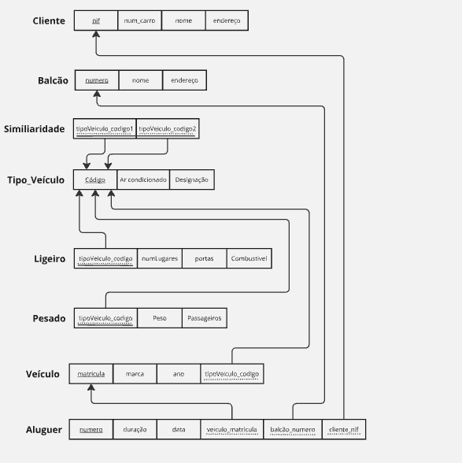
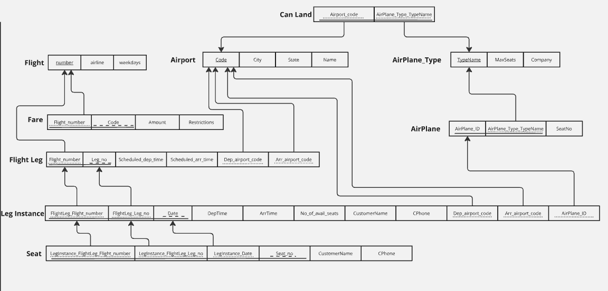
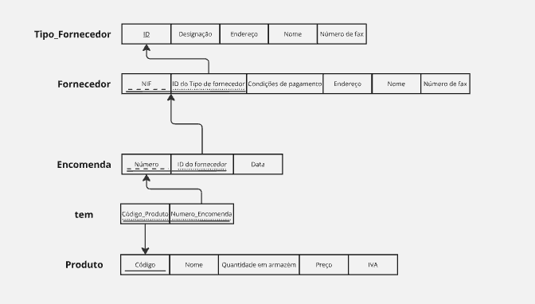
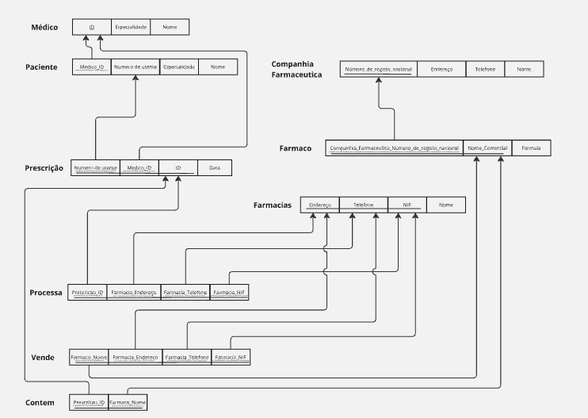
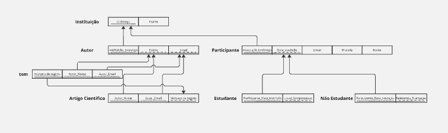
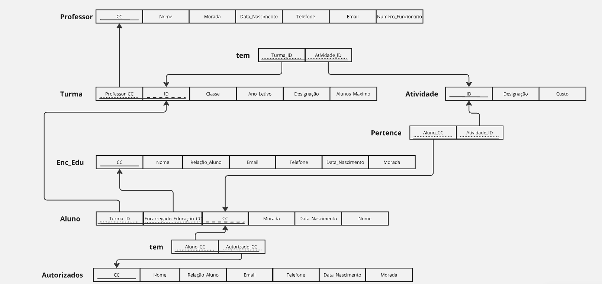

# BD: Guião 3


## ​Problema 3.1
 
### *a)*

```
Tipo_Veiculo: Codigo, Designacao, ArCondicionado
Similaridade: TipoVeiculo_Codigo1, TipoVeiculo_Codigo2
Veiculo: Matricula, Marca, Ano, TipoVeiculo_Codigo
Cliente: NIF, Nome, Endereco, Num_Carta
Balcao: Numero, Nome, Endereco
Aluguer: Numero, Duracao, Data, Veiculo_Matricula, Balcao_Numero, Cliente_NIF
Ligeiro: TipoVeiculo_Codigo, Combustivel, Portas, NumLugares
Pesado: TipoVeiculo_Codigo, Peso, Passageiros
```

<pre>
Tipo_Veiculo: <u>Codigo</u>, Designacao, ArCondicionado
Similaridade: <span style="padding-bottom:1px; border-bottom: solid 1px;"><span style="text-decoration: underline; text-decoration-style: dotted">TipoVeiculo_Codigo1</span>, <span style="text-decoration: underline; text-decoration-style: dotted">TipoVeiculo_Codigo2</span></span>
Veiculo: <u>Matricula</u>, Marca, Ano, <span style="text-decoration: underline; text-decoration-style: dotted">TipoVeiculo_Codigo</span>
Cliente: <u>NIF</u>, Nome, Endereco, Num_Carta
Balcao: <u>Numero</u>, Nome, Endereco
Aluguer: <u>Numero</u>, Duracao, Data, <span style="text-decoration: underline; text-decoration-style: dotted">Veiculo_Matricula</span>, <span style="text-decoration: underline; text-decoration-style: dotted">Balcao_Numero</span><span style="text-decoration: underline; text-decoration-style: dotted">Cliente_NIF</span>
Ligeiro: <span style="padding-bottom:1px; border-bottom: solid 1px"><span style="text-decoration: underline; text-decoration-style: dotted">TipoVeiculo_Codigo</span></span>, Combustivel, Portas, NumLugares
Pesado: <span style="padding-bottom:1px; border-bottom: solid 1px"><span style="text-decoration: underline; text-decoration-style: dotted">TipoVeiculo_Codigo</span></span>, Peso, Passageiros
</pre>


### *b)* 

```
Tipo_Veiculo:
Candidatas: Codigo
Primárias: Codigo
Estrangeiras: Não tem

Veiculo:
Candidatas: Matricula
Primárias: Matricula
Estrangeiras: TipoVeiculo_Codigo

Cliente:
Candidatas: NIF
Primárias: NIF
Estrangeiras: Nao tem

Balcao:
Candidatas: Numero
Primárias: Numero
Estrangeiras: Nao tem

Aluguer:
Candidatas: Numero, Data
Primárias: Numero
Estrangeiras: Balcao_Numero_Cliente_NIF

Ligeiro:
Candidatas: Nao tem
Primárias: TipoVeiculo_Codigo
Estrangeiras: TipoVeiculo_Codigo

Pesado:
Candidatas: Nao tem
Primárias: TipoVeiculo_Codigo
Estrangeiras: TipoVeiculo_Codigo
```


### *c)* 




## ​Problema 3.2

### *a)*


```
Flight: Number, airline, weekdays
Fare: Flight_Number, Code, Amount, Restrictions
Flight Leg: Flight_number, Leg_no, Scheduled_dep_time, Scheduled_arr_time, Dep_airport_code, Arr_airport_code
Leg Instance: FlightLeg_Flight_Number, FlightLeg_Leg_no, Date, DepTime, ArrTime, No_of_avail_seats, CustomerName, CPhone, Dep_airport_code, Arr_airport_code, AirPlane_ID
Seat: LegInstance_FlightLeg_Flight_number, LegInstance_FlightLeg_Leg_no, LegInstance_Date, Seat_no, CustomerName, CPhone
AirPlane: Airplane_ID, AirPlane_Type_TypeName, SeatNo,
AirPlane_Type: TypeName, MaxSeats, Company
Can Land: Airport_code, AirPlane_Type_TypeName
Airport: Code, City, State, Name
```


### *b)* 

```
Flight:
Candidatas: Number
Primárias: Number
Estrangeiras: Não tem 

Fare:
Candidatas: Code
Primárias: Code, Flight_Number
Estrangeiras: Flight_Number

Flight Leg:
Candidatas: Leg_no
Primárias: Leg_no, Flight_Number
Estrangeiras: Flight_Number

Leg Instance:
Candidatas: Date
Primárias: Date, FlightLeg_Flight_Number, FlightLeg_Leg_no
Estrangeiras: FlightLeg_Flight_Number, FlightLeg_Leg_no

Seat:
Candidatas: Seat_no
Primárias: Seat_no, LegInstance_FlightLeg_Flight_number, LegInstance_FlightLeg_Leg_no, LegInstance_Date
Estrangeiras: LegInstance_FlightLeg_Flight_number, LegInstance_FlightLeg_Leg_no, LegInstance_Date

AirPlane:
Candidatas: Airplane_ID
Primárias: Airplane_ID, AirPlane_Type_TypeName
Estrangeiras: AirPlane_Type_TypeName

AirPlane_Type:
Candidatas: TypeName
Primárias: TypeName
Estrangeiras: nao tem

Can Land: Airport_code, AirPlane_Type_TypeName
Candidatas: Airport_code, AirPlane_Type_TypeName
Primárias: Airport_code, AirPlane_Type_TypeName
Estrangeiras: Airport_code, AirPlane_Type_TypeName

Airport: Code, City, State, Name
Candidatas: Code
Primárias: Code
Estrangeiras: nao tem
```


### *c)* 




## ​Problema 3.3


### *a)* 2.1



### *b)* 2.2



### *c)* 2.3



### *d)* 2.4

