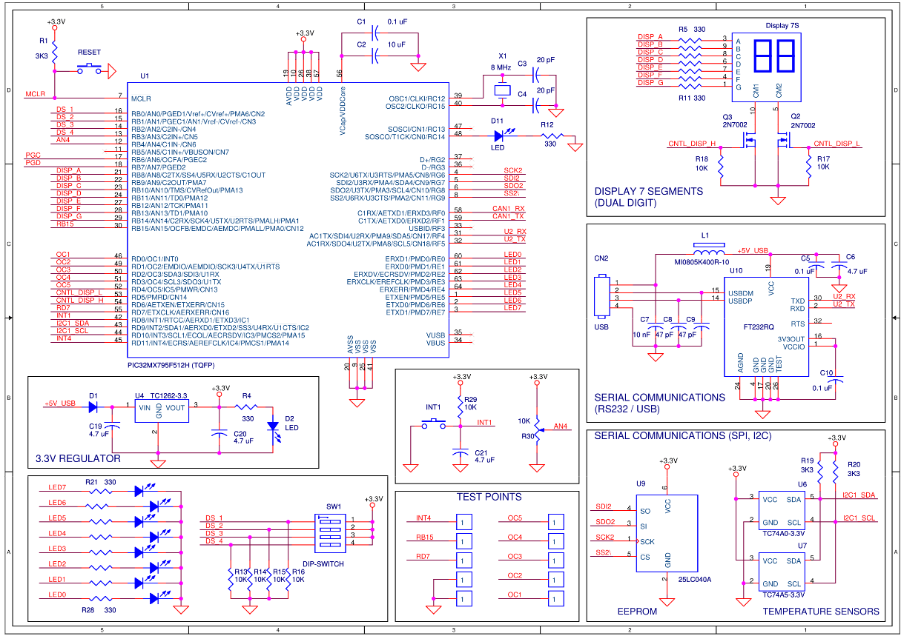

# 🧠 Real-Time Data Acquisition and Monitoring System on PIC32

    

---

## 📋 Project Overview

This project was developed as part of the **Computer Architecture II** course. It involves the design and implementation of a sophisticated, real-time embedded system on a board created and given by the professors called *detpic32*, which included the microcontroller PIC32MX from Microchip.

The system performs continuous acquisition of an analog voltage signal, processes it, and provides multiple output interfaces: a **local display** and a **serial command interface**. It is a comprehensive demonstration of low-level C programming, peripheral control, and real-time system design.

---

## 🎯 System Functionality

The system transforms a simple potentiometer into a smart sensor node with the following features:

- **Real-Time Analog Acquisition:** Samples an analog voltage at 5 Hz.
- **Signal Processing:** Calculates the average of 8 samples and converts the digital value back to a physical voltage.
- **Local Display:** Shows the current voltage value (in Volts) on a dual 7-segment display.
- **Serial Monitoring:** Provides a command-line interface via UART (115200 baud) to query the minimum and maximum voltage readings since startup.
- **Autonomous Operation:** Runs seamlessly in the background using interrupt-driven routines.

--- 

## ⚙️ Technical Specifications & Hardware

- **Microcontroller:** Microchip PIC32MX795F512H
- **Clock Frequency:** 40 MHz (CPU), 20 MHz (Peripheral Bus)
- **Analog Input:** Potentiometer connected to analog channel AN4 (RB4)
- **Display:** Dual 7-segment display (multiplexed via Port B segments, Port D control)
- **Communication:** UART2 @ 115200 baud, 8N1, connected to a PC terminal
- **Programming Language:** C

--- 

## 🏗️ System Architecture & Key Techniques

The project integrates multiple microcontroller peripherals, managed efficiently through Interrupt Service Routines (ISRs).

### Peripherals Used:
- **ADC (Analog-to-Digital Converter):** 10-bit resolution, 8-sample buffer.
- **Timers (T1 & T3):**
    - **Timer1:** Triggers a new ADC conversion sequence at 5 Hz.
    - **Timer3:** Drives the display refresh at 100 Hz for flicker-free operation.
- **UART2:** Handles full-duplex serial communication for the command interface.
- **I/O Ports:** Control the 7-segment displays and read the analog input.

### Interrupt Service Routies (ISRs):

1. **isr_T1 (5 Hz):** Initiates the ADC sampling process.
2. **isr_adc:** Reads the 8-sample buffer, calculates the average and voltage value, and updates the global min/max.
3. **isr_T3 (100 Hz):** Manages the multiplexing of the 7-segment displays.
4. **isr_UART2:** Listens for incoming commands ('M' or 'm') and transmits the corresponding voltage string.

### Algorithmic Highlights:

- **Fixed-Point Arithmetic:** Efficient voltage calculation V = (33 * raw_value + 511) / 1023 avoids floating-point operations.
- **BCD Conversion:** Converts the voltage value to Binary-Coded Decimal for display output.
- **Ring Buffer Management:** Efficient handling of the ADC sample buffer.
- **Command Parsing:** Simple yet effective interpretation of serial commands.

--- 

## 📊 Serial Protocol & Usage

The system responds to the following commands sent via a serial terminal (pterm):
| Command   | Response Example  | Description                           |
| --------- | ----------------- | ------------------------------------- |
| M	        | VMax=3.2V	        | Returns the maximum voltage recorded  |
| m	        | VMin=0.1V	        | Returns the minimum voltage recorded  |

## 🔧 Development & Debugging

- **Toolchain:** pic32-gcc compiler and associated tools.
- **Debugging:** Strategic use of a digital output (RD11) and an **oscilloscope** to measure critical timings, such as ADC conversion time and interrupt latency.
- **Design Philosophy:** The implementation prioritizes efficiency and reliability, using volatile variables for shared data and careful masking of I/O operations.

## 📈 Key Challenges & Solutions
| Challenge                             | Solution                                                                                      |
| ------------------------------------- | --------------------------------------------------------------------------------------------- |
| **Synchronizing Multiple Interrupts** | Carefully assigned priorities to ensure timely response to all events without data corruption. |
| **Efficient Display Multiplexing**    | Used a 100 Hz timer interrupt and a state variable to alternate between digits, eliminating flicker. |
| **Accurate Voltage Calculation**      | Implemented a fixed-point arithmetic formula with proper rounding for precision.              |
| **Real-Time Command Response**        | UART RX interrupt provides immediate response to commands without blocking the main loop.      |

## ✅ Results & Conclusions

- Successfully created a robust and responsive real-time monitoring system.
- The system reliably samples, processes, and displays data while simultaneously handling asynchronous serial commands.
- This project demonstrates a strong understanding of fundamental embedded concepts: peripheral control, interrupt handling, timing, and hardware interfacing.