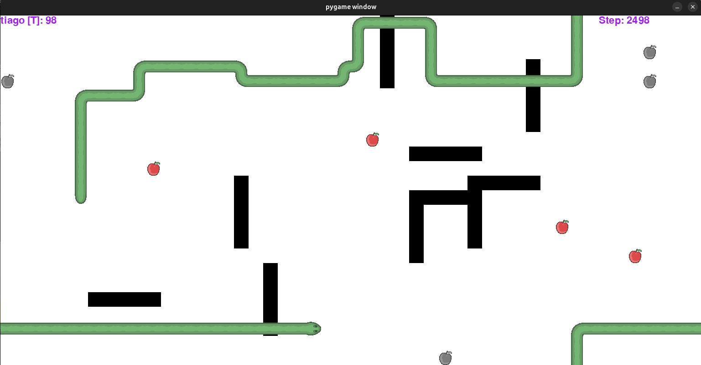

# 🐍 Development of an Autonomous Agent for Snake



---

## 📋 Project Overview

This project was developed as part of the **Artificial Intelligence** course.
It focuses on the design and implementation of an **autonomous agent** to play the classic Snake game, using concepts from:

* Python programming
* Agent architectures
* Search techniques for problem solving

> **Note:** The Snake game itself was provided by the instructors. The contribution of this project is the **autonomous agent**.

---

## 🎮 Game Rules

- The map is **spherical** (wraps around itself).
- The snake head **never stops** and keeps growing.
- Obstacles to avoid:
    - Randomly spawned walls
    - Map borders
    - The snake’s own body
    - Other snakes’ bodies (multiplayer mode)
- Each snake has a **limited field of view**.
- The game ends when all snakes die or **3000 steps** are reached.
- Apples:
  - **Normal apples**: +1 point, +1 length
  - **Special apples**: either *Super Food* or *Poison* (unknown until eaten)
    - Effects:
      - **Points**: \[-5, 10]
      - **Length**: \[-2, 2] (min length = 2)
      - **Range**: \[-2, 2] (between 2 and 6)
      - **Traverse**: toggles ability to go through walls/borders

---

## 🧠 Agent Architecture

### Basic Behavior

At every game tick, the agent:

1. Receives map and game state information from the server.
2. Filters possible actions:
   * Removes opposite direction of last move (to avoid self-collision)
   * Removes moves leading to immediate collision (walls, body, border if traverse = false)
   * Removes moves leading to loops/encapsulation
3. If an apple is visible on the same row/column, it prioritizes it.
4. If no apple is visible, it falls back to a **default exploration strategy**.

### With Traverse == True

* If an apple is visible → move towards it.
* Else → explore the map with a *zig-zag sweeping pattern*:
  * 40 steps straight horizontally
  * 7 steps upward
  * Repeat
* Interrupted if needed to avoid death or catch an apple.

### With Traverse == False

* If an apple is visible → move towards it.
* Else → follow a simple pattern:
  * 12 steps straight
  * Then random safe action (no collision or loop)
  * Reset counter if interrupted.

---

## 🔎 Algorithms Implemented

* **Collision detection**
  `will_hit_test()` checks whether the next move collides with walls, body, or borders.
* **Loop prevention**
  `calculate_and_compare()` computes safe areas around the snake using a **flood-fill** area calculation.
  * Selects moves leading to largest open areas, avoiding self-traps.
* **Apple pursuit**
  Simple heuristic: if an apple is visible and aligned on X or Y axis, choose the direction towards it.

---

## 📊 Benchmarks

The project evolved in several stages:

| Stage           | Features Implemented            | Avg. Score |
| --------------- | ------------------------------- | ---------- |
| Initial         | Random moves, no wall avoidance | \~20       |
| Wall avoidance  | Collision map implemented       | \~50       |
| Loop prevention | Flood fill area calculation     | \~75       |
| Final version   | Optimized movement strategies   | \~100      |

---

## ✅ Conclusions

* The agent improved consistently through iterative development and testing.
* The **loop-avoidance algorithm** (flood-fill) was the hardest but most impactful feature.
* Current implementation works well in single-player but could be extended with:
  * Heuristics for **multiplayer** (predicting enemy snake paths)
  * Smarter **apple prioritization**
  * More efficient **exploration strategies**
* The Biggest strength of this project is the agent's ability to evade death. No matter if it is single player or multiplayer, **it will always survive until the end**.
---

## ⚙️ How to Run

* Requires Python 3.11
* Install dependencies:
  ```bash
  pip install -r requirements.txt
  ```
* Run in three terminals:
  ```bash
  python3 server.py
  python3 viewer.py
  python3 client.py
  ```
 
