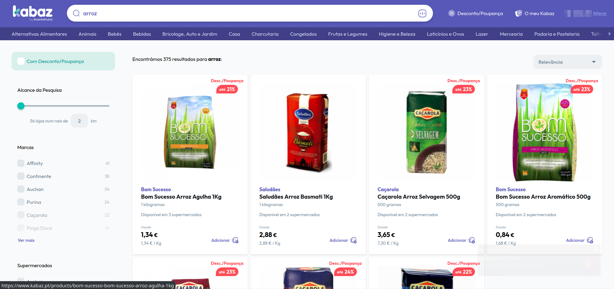

# Competitor Analysis: Kabaz 
## General Information
- **Name of System** Kabaz
- **Company** KuantoKusta 
- **Website:** www.kabaz.pt
- **Release Date:** 29/01/2024 
- **Platform(s) Supported** Web
- **Target Audience** Todos os compradores, nomeadamente os mais poupados 

--- 
## Core Functionality

**Primary Purpose** Comparação de preços de produtos alimentares em lojas próximas ao utilizador

**Key Features** - Comparação de preços de supermercados distintos - Pesquisa por área geográfica - Filtro por marca do produto 

**Unique Selling Points (USPs)** - O mesmo que o propósito principal, acrescido ao facto de ser uma das únicas plataformas para o efeito em Portugal

**Limitations** - Ausência de costumização e menus de preferências na pesquisa pelos produtos (por exemplo, filtros para intolerâncias alimentares). Ausência de informação relevante ao utilizador (por exemplo, informação nutricional de um produto)

---

## Screenshots

### Página inicial da plataforma Kabaz

### Página apresentada quando um produto é pesquisado

## Online Reviews
Não existentes / não encontrados:
- Trustpilot --> Sem página criada
- Facebook --> 0 *reviews*
- Sitejabber --> 0 *reviews*

Outras plataformas de *review* de *websites* menos populares também não apresentavam nenhuma informação 