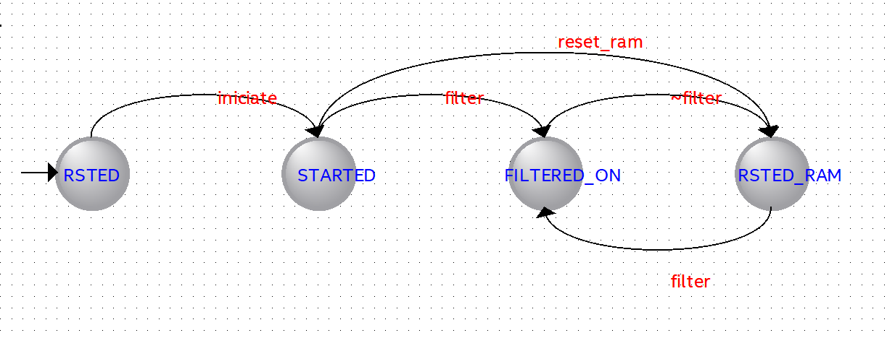

# 2nd Derivative Filter Implementation on FPGA

## 📋 Project Overview

This project involves designing, simulating, synthesizing, and implementing a **2nd derivative filter** on a Terasic DE2-115 FPGA kit. The filter highlights peak moments in an input signal by approximating the second derivative using discrete samples.

  

## 🎯 Objective

Implement a digital system that:
- Reads an 8-bit signed triangular wave signal from a 256x8-bit ROM
- Processes the signal using the 2nd derivative approximation formula
- Stores the filtered output in a 256x8-bit RAM
- Displays both input (ROM) and output (RAM) values on hexadecimal displays

## ⚙️ Technical Specifications

**Filter Formula:**

**Signal Characteristics:**
- Input signal: Triangular wave with 60s period
- Sampling frequency: 2Hz
- Total duration: 128 seconds
- Data format: 8-bit signed values

**FPGA Interface:**
- `START`: KEY0
- `FILTER_ON`: SW(0)
- `RESET_RAM`: KEY1
- `RESET`: KEY2 (system reset)
- `HEX3...HEX0`: ROM content (input signal)
- `HEX7...HEX4`: RAM content (filtered output)

## 🏗️ Implementation Phases

### Phase 1 - ROM Address Generator
Implemented an address generator to read signed data from the ROM using the provided `TriangSignal_ROM256x8.vhd` file.

### Phase 2 - RAM Address Generator and Reset
Implemented address generation for RAM with `RESET_RAM` functionality to fill RAM with x"00" using the 50 MHz system clock.

### Phase 3 - Delay Line Storage
Created a serial-in parallel-out shift register (delay line) that stores 3 consecutive 8-bit input samples for the filter calculation.

### Phase 4 - Arithmetic Unit
Designed a computational unit that implements the 2nd derivative formula using the 3 stored samples and writes results to RAM.

### Phase 5 - Control Unit (State Machine)
Developed a finite state machine controller that:
- Starts with RAM reset
- Manages the filtering process
- Handles all control signals and system interface

### Phase 6 - System Integration
Integrate all components into a top-level structural VHDL design and verify real-time filtering operation against the reference file `LSD_2ndDeriv_Signals.xlsx`.

## 📊 System Architecture

The proposed architecture includes:
- Address generators for ROM and RAM
- Delay line (shift register) for sample storage
- Arithmetic unit for filter calculation
- Control unit (state machine)
- Display interfaces for input and output signals
- Pulse generators and timing control

## 🛠️ Tools & Technologies

- **Hardware**: Terasic DE2-115 FPGA kit
- **Design Language**: VHDL (structural design)
- **Simulation**: ModelSim/Quartus Prime
- **Synthesis**: Intel Quartus Prime

## 📁 Project Files

- `TriangSignal_ROM256x8.vhd` - Pre-provided ROM component
- `LSD_2ndDeriv_Signals.xlsx` - Reference signals for quality control
- Top-level structural VHDL design files

## 📄 Project Presentation

For a more complete description of the design, implementation details and diagrams, see the Project_Presentation.pdf in the repository root.

## ✅ Validation

The implemented system must produce filtering results that match the reference sequences provided in the auxiliary Excel file, ensuring proper quality control of the 2nd derivative filter implementation.